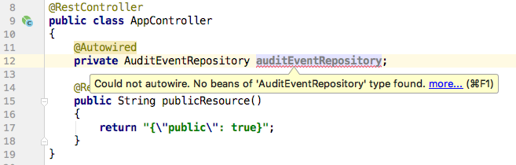
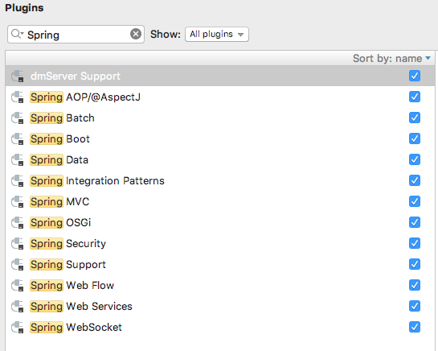

Bug screenrecord: https://youtu.be/KyvitXRS7AE  
IntelliJ community request: https://intellij-support.jetbrains.com/hc/en-us/community/posts/115000716544-No-beans-of-AuditEventRepository-type-found-Spring-Boot-and-Actuator-1-5-9-RELEASE  
 
Spring Boot and Actuator 1.5.9.RELEASE 
 
IntelliJ IDEA 2017.2.6 
Build #IU-172.4574.11, built on November 13, 2017 
JRE: 1.8.0_152-release-915-b12 x86_64 
JVM: OpenJDK 64-Bit Server VM by JetBrains s.r.o 
Mac OS X 10.13.1 
 
 
 
 
